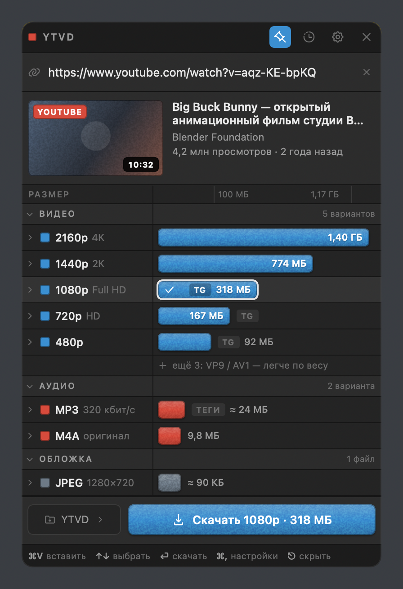

# YTVD — виджет для скачивания видео

Компактный нативный виджет для macOS: скопировали ссылку — он предлагает варианты,
показывает превью и качает видео, звук или обложку.

Поддерживаются **YouTube, Vimeo, Rutube, VK Видео**. Приложение весит около 5 МБ,
запускается примерно за 0,2 с и живёт иконкой в меню-баре, без Dock.



## Главная идея интерфейса

Варианты загрузки показаны как дорожки таймлайна: **длина плашки равна весу файла**,
поэтому разница между 4K и 1080p видна за полсекунды, без чтения цифр.
Шкала корневая (√), чтобы мелкие файлы не схлопывались в точку; сверху линейка с делениями.

Цвет говорит, что получится:

| Цвет | Что это |
|---|---|
| 🔵 синий | видео H.264 в MP4 — играет везде, годится для Telegram и iPhone |
| 🟠 оранжевый | видео VP9 / AV1 — легче по весу либо выше разрешением, нужен современный плеер |
| 🔴 красный | только звук: MP3 320 или оригинальная дорожка без перекодирования |
| ⬜ стальной | обложка JPEG |

## Как пользоваться

1. Скопировали ссылку — в виджете появляется полоска с ней. Нажмите «Вставить» или `⌘V`.
2. Приложение разбирает ролик и показывает варианты с точными размерами.
3. Стрелками `↑` `↓` выбираете строку, `⏎` — качать. Чеврон слева раскрывает кодек, битрейт и itag.
4. Обложку можно скачать отдельно: кнопка **JPG** на превью или строка «Обложка» в списке.

Вторая ссылка, скопированная во время загрузки, встаёт в очередь — текущая закачка не прерывается.
Нажатие на логотип «YTVD» возвращает виджет на начальный экран.

### Клавиши

| Сочетание | Действие |
|---|---|
| `⌥⌘D` | показать или спрятать виджет (работает из любого приложения) |
| `⌘V` | в строке — вставить текст; вне строки — сразу взять ссылку из буфера и разобрать |
| `↑` `↓` | выбрать вариант |
| `⏎` | скачать выбранное |
| `⌘,` | настройки |
| `⌘Y` | история |
| `⎋` | закрыть панель или спрятать виджет |

## Установка

Нужны `yt-dlp` и `ffmpeg` — приложение ищет их само в Homebrew, MacPorts, `/usr/local/bin`
и `~/.local/bin`.

```bash
brew install yt-dlp ffmpeg
```

Затем соберите и положите приложение в «Программы»:

```bash
cd YTVD && ./scripts/make-app.sh --install
```

Готовое приложение — `YTVD/dist/YTVD.app`, универсальный бинарник (Apple Silicon и Intel).
Подпись ad-hoc: на своей машине запустится, для раздачи другим понадобится Developer ID.

Проверить, что движок найден:

```bash
/Applications/YTVD.app/Contents/MacOS/YTVD --doctor
```

## Когда площадка не пускает

Самая частая причина отказов — **не приложение, а адрес, с которого пришёл запрос**.
Приложение это распознаёт и пишет по-русски, что делать, вместо технического вывода yt-dlp.
Оно само проверяет, поднят ли VPN, и добавляет это в подсказку.

| Симптом | Причина | Что делать |
|---|---|---|
| Rutube и VK: описание грузится, видео нет | раздачей занят отдельный сервер, ему нужен российский IP | в исключения VPN нужны и `rutube.ru`, и `rtbcdn.ru` (для VK — `vk.com`, `vkvideo.ru`, `userapi.com`) |
| Vimeo: 403 или 401 на любой ссылке | Vimeo закрывает главную страницу от не-браузеров | приложение само повторяет попытку через `player.vimeo.com` |
| Vimeo: «владелец ограничил доступ» | у ролика включено ограничение на встраивание (`PrivacyError`) | ничего — такой ролик закрыт для любых сторонних программ |
| YouTube: «подтвердите, что вы не робот» | сработала защита от ботов | настройки → «Брать cookies из браузера» |

В настройках есть два сетевых пункта: **cookies из браузера** (Chrome, Safari, Firefox —
помогает там, где нужен вход) и **свой прокси** (`socks5://…`) — загрузки пойдут через него
независимо от системного VPN.

## Разработка

```bash
cd YTVD
swift build                # сборка
swift test                 # 139 тестов
./scripts/make-app.sh      # собрать YTVD.app в dist/
```

Служебные режимы приложения — ими же проверялась работа:

```bash
YTVD --doctor                        # какие yt-dlp и ffmpeg найдены
YTVD --analyze <ссылка>              # разобрать ролик и показать варианты
YTVD --fetch <ссылка> [каталог]      # скачать самый лёгкий вариант целиком
YTVD --render <каталог>              # отрисовать окно во всех состояниях в PNG
```

`--render` рисует настоящий интерфейс офскрин — так проверяется вёрстка всех
тринадцати состояний без запуска окна и без прав на запись экрана. Результат лежит
в [screenshots/](screenshots).

### Устройство

```
Sources/YTVDCore/
  Models/      разбор SVG-контуров, форматирование по-русски, определение площадки,
               ссылки Vimeo, модель вариантов и правила их подбора (OptionBuilder)
  Services/    запуск процессов, поиск бинарников, разбор вывода yt-dlp, сеть и VPN,
               скачивание, обложки, буфер обмена, настройки, история
  Views/       SwiftUI: тема, иконки, карточка превью, дорожки, панели, модель состояния
Sources/YTVD/  точка входа: безрамочное окно, меню-бар, глобальный хоткей
Tests/         139 тестов на всю логику
prototype/     утверждённый прототип интерфейса (HTML)
screenshots/   все состояния окна, отрисованы самим приложением
```

Логика отделена от интерфейса: подбор вариантов, форматирование, сборка аргументов
командной строки и разбор вывода — чистые функции, проверенные тестами.

## Правила подбора вариантов

* Основной список — H.264 в MP4: такой файл открывается везде.
* К видео подцепляется **стереодорожка**: YouTube отдаёт ещё и 5.1 на 387 кбит/с,
  она втрое тяжелее и для просмотра не нужна.
* «Кодек не указан» и «кодека нет» — разные вещи. Vimeo отдаёт звук дорожками без
  указания кодека; если считать это отсутствием звука, видео скачается немым.
* VP9 / AV1 попадают в список, только если реально легче того же разрешения
  минимум на 12 % — или если в H.264 такого разрешения вовсе нет (например, 4K).
* Размер берётся из ответа площадки; если его нет — считается по битрейту
  и показывается со знаком «≈». Совсем неизвестный размер показывается прочерком.
* Обложка выбирается по `preference`, а не по ширине: у YouTube лучшие картинки
  приходят без размеров. При равном качестве предпочитается JPEG, а не WebP.

## Лицензии

Иконки — [Obra Icons](https://icons.obra.studio), MIT, © 2025 Obra Studio BV.
Полный текст: [prototype/OBRA-ICONS-LICENSE.md](prototype/OBRA-ICONS-LICENSE.md).

## Откуда взялось оформление

В [design/](design) лежат исходные материалы: `sketch-original.jpg` — первоначальный
эскиз интерфейса, `reference-timeline-ui.png` — референс блочного стиля, из которого
выросли дорожки, зерно на плашках и цветовые метки.
