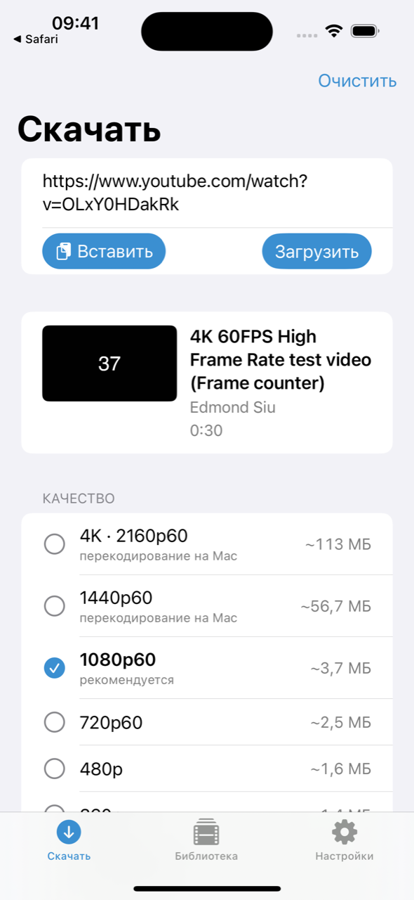
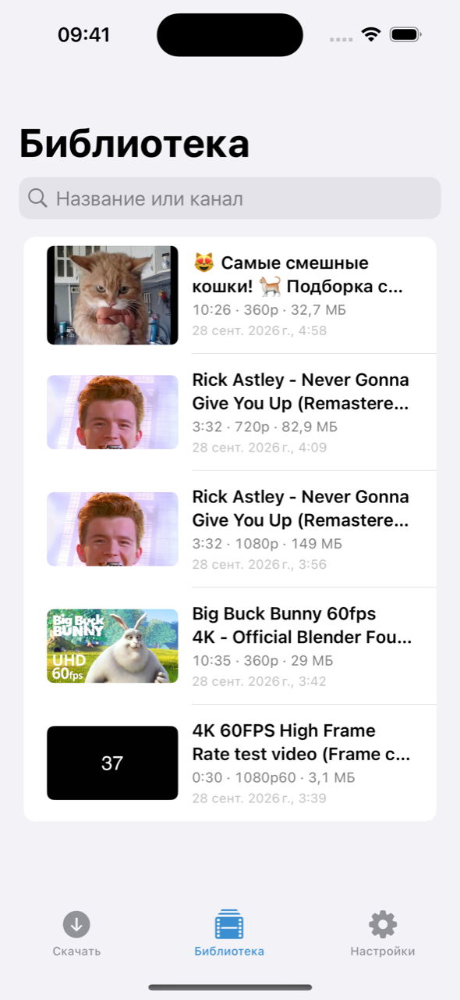
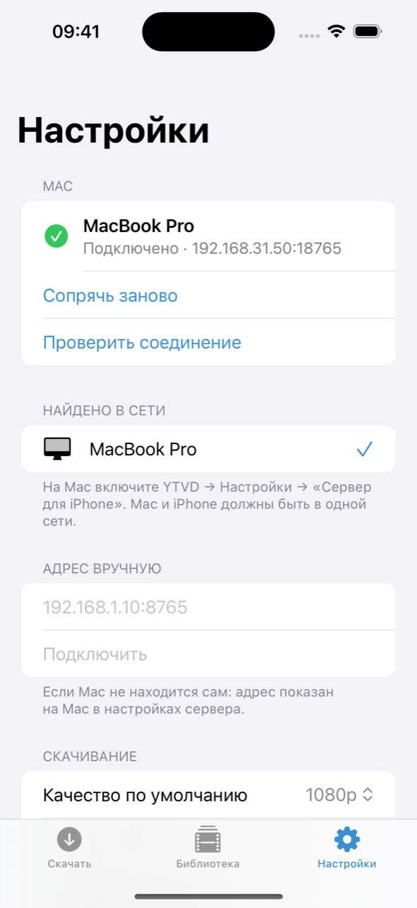

# VideoDownloader — приложение для iPhone


Личное приложение: поделились ссылкой из YouTube — оно показывает обложку и настоящие
варианты качества, Mac скачивает ролик тем же движком, что и YTVD, а iPhone забирает
готовый файл к себе. Смотреть можно без интернета, в том числе на телевизоре через AirPlay.

<p>



</p>

## Как это устроено

```
iPhone (SwiftUI, AVKit, SwiftData)
   │  REST по домашней сети · Authorization: Bearer <токен>
   ▼
YTVD на Mac — сервер для iPhone (Network.framework, Bonjour _ytvd._tcp)
   │  тот же MediaService, что у окна YTVD
   ▼
yt-dlp + ffmpeg + deno  →  YouTube, Vimeo, Rutube, VK Видео
```

- **iPhone ничего не знает о yt-dlp.** Он говорит только на контракте из `YTVD/Sources/YTVDAPI`,
  поэтому сервер можно будет перенести на VPS, не трогая приложение.
- **Mac качает и склеивает.** До 1080p — H.264 + AAC без перекодирования, только склейка
  дорожек. Выше 1080p YouTube отдаёт лишь VP9 и AV1, которые iPhone не играет, — такие
  варианты Mac перекодирует в HEVC аппаратным кодировщиком (`hevc_videotoolbox`, тег `hvc1`).
- **iPhone забирает готовый файл фоновой загрузкой.** Она ставится сразу после «Скачать»
  и ждёт на сервере, пока Mac закончит, — поэтому экран можно заблокировать в любой момент.
  Обрыв связи — докачка с того же места (HTTP Range + If-Range), не заново.
- **Прямую загрузку с серверов YouTube на iPhone** я исследовал и отверг: ссылки привязаны
  к IP-адресу Mac, живут 6 часов, видео и звук идут раздельно. Подробности —
  в [аудите](IPHONE_EXTENSION_AUDIT.md).

## Включить сервер на Mac

1. YTVD → Настройки → **«Сервер для iPhone»** — включить. Под переключателем появится адрес.
2. **«Показать код»** — шестизначный код для iPhone, действует 5 минут и один раз.
3. Если включён файрвол macOS, он спросит, пускать ли входящие соединения к YTVD, — разрешить.

«Доступ к серверу»: **Сеть** — iPhone в той же сети (по коду); **Только Mac** — для проверки
через `curl`. «Отключить все iPhone» меняет токен: каждому устройству понадобится новый код.
Наружу, в интернет, сервер сам не выставляется — только локальная сеть.

Без окна, из терминала (Enter — новый код сопряжения):

```bash
/Applications/YTVD.app/Contents/MacOS/YTVD --serve --port 8765 --bind 0.0.0.0
```

Порт и адрес для приложения меняются так: `defaults write studio.dk.ytvd serverPort -int 8765`,
`defaults write studio.dk.ytvd serverBind all` (`all`, `loopback` или конкретный IP).
Токен и задания лежат в `~/Library/Application Support/YTVD/server` (файл токена — `0600`).
Готовые файлы, которые iPhone не забрал, удаляются через 48 часов.

## Поставить приложение на iPhone

1. Открыть в Xcode `ios/VideoDownloader/VideoDownloader.xcodeproj`.
2. Подпись: вписать Team ID в `ios/VideoDownloader/Config/Signing.xcconfig`
   (`DEVELOPMENT_TEAM = …`) или выбрать команду на вкладке *Signing & Capabilities*
   у обеих целей — **VideoDownloader** и **VideoDownloaderShare**. Если Xcode скажет, что
   идентификатор занят, поменяйте там же `BUNDLE_ID_PREFIX`.
3. Подключить iPhone кабелем, выбрать его в Xcode и нажать Run. На iPhone один раз:
   Настройки → Конфиденциальность и безопасность → **Режим разработчика**, затем
   Основные → VPN и управление устройством → доверять своему сертификату.
4. С бесплатной учётной записью Apple приложение работает 7 дней — потом просто
   запустить из Xcode ещё раз. Если бесплатная подпись не выдаст App Group, расширение
   «Поделиться» всё равно передаст ссылку: оно открывает приложение сразу со ссылкой.

## Первое подключение

Вкладка **Настройки** → «Найдено в сети» → ваш Mac → ввести код с Mac. При первом поиске
iOS спросит доступ к локальной сети — его нужно разрешить. Если Mac не находится сам
(гостевая сеть, «изоляция клиентов» на роутере), введите адрес вручную: он показан на Mac
под переключателем сервера.

## Пользоваться

- **YouTube → Поделиться → VideoDownloader.** Приложение откроется со ссылкой, Mac разберёт
  ролик, по умолчанию выбрано качество из настроек. Можно и вставить ссылку кнопкой
  «Вставить»: буфер обмена читается только по нажатию, без постоянных запросов.
- **Скачать** — карточка показывает этап («Mac скачивает видео», «Объединение видео и аудио…»,
  «Передача на iPhone»), проценты, байты, скорость и время. На склейке и перекодировании
  без понятного прогресса — крутилка, а не зависшие «100 %».
- **Уже скачано?** Появится «Видео уже находится в библиотеке»: смотреть, скачать в другом
  качестве или заменить.
- **Библиотека** — долгое нажатие: смотреть, поделиться (файл уходит под названием ролика),
  сохранить в «Фото», информация, удалить (удаляются файл, обложка и запись).
- **Плеер** — системный: перемотка, полный экран, поворот, «картинка в картинке», AirPlay,
  скорость, громкость, управление с экрана блокировки.
- **Настройки** — качество по умолчанию, «Только по Wi-Fi», «Сохранять в «Фото»»,
  «Оставлять копию на Mac», сведения для отладки и кнопка «Обновить движок на Mac».

## Если что-то не так

| Сообщение | Что сделать |
|---|---|
| «YouTube требует подтвердить, что вы не робот» | на Mac в настройках YTVD включить «Брать cookies из браузера» |
| «Площадка заблокировала адрес» | выключить VPN на Mac или добавить сайт в исключения |
| «Движок на Mac устарел» | Настройки → Сведения для отладки → «Обновить движок на Mac» |
| «Mac недоступен» | YTVD запущен, сервер включён, Mac и iPhone в одной сети, файрвол пропускает YTVD |
| «Mac не узнаёт этот iPhone» | на Mac «Показать код», на iPhone «Сопрячь заново» |
| «Недостаточно свободного места» | освободить место — на iPhone или на Mac, текст скажет, где |

## API

Все ответы — JSON в `snake_case`, ошибки — `{"error": {"code", "message"}}` с человеческим
текстом по-русски. Всё, кроме `info` и `pair`, требует `Authorization: Bearer <токен>`.

| Метод | Путь | Что делает |
|---|---|---|
| GET | `/api/v1/info` | имя Mac и версии; версии инструментов и свободное место — только с токеном |
| POST | `/api/v1/pair` | `{code, device_name}` → `{token, server_name}` |
| POST | `/api/v1/resolve` | `{url}` → название, канал, длительность, обложка, варианты качества |
| POST | `/api/v1/download` | `{url, format_id}` → задание (`202`) |
| GET | `/api/v1/jobs` | все задания |
| GET | `/api/v1/jobs/{id}` | статус, прогресс, байты, скорость, ETA, ошибка, имя файла |
| POST | `/api/v1/jobs/{id}/cancel` | отменить |
| DELETE | `/api/v1/jobs/{id}` | удалить задание и файл на Mac |
| GET/HEAD | `/api/v1/jobs/{id}/file` | файл потоком, Range/If-Range; `?wait=1` — дождаться готовности |
| POST | `/api/v1/engine/update` | обновить yt-dlp на Mac (исполняемый код меняется только там) |

Статусы задания: `queued`, `resolving`, `downloading_video`, `downloading_audio`, `merging`,
`transcoding`, `ready`, `failed`, `cancelled`, `interrupted` (Mac перезапустился посреди работы).
Варианты качества — стабильные идентификаторы вроде `h1080-60`, `h2160-60`, `audio`, а не
номера форматов yt-dlp.

## Что проверено

Автотесты: 57 на сервер (маршруты, авторизация, Range через настоящий сокет, очередь,
перезапуск, место на диске, ошибки, выбор обложки), 2 на раздел настроек сервера,
27 на iPhone-приложение (ссылки, разбор ответов, варианты качества, библиотека, имена
файлов, дубликаты). Прежние 155 тестов YTVD проходят — всего у Mac-части 214.

Руками — на Mac через `curl` и в симуляторе iPhone 16 (iOS 18.5) против настоящего сервера:

| Случай | Итог |
|---|---|
| 720p со звуком (Rutube) | ✅ 82,9 МБ, играет |
| 1080p, видео и звук раздельно (YouTube 1080p60, Rutube 1080p) | ✅ склейка без перекодирования, H.264 + AAC |
| 2160p/4K | ✅ перекодирование в HEVC 3840×2160, 30 с ролика — 23 с на Mac, играет в AVFoundation |
| 1440p | ⚠️ тот же путь, что 4K; отдельно на настоящем ролике не качал |
| Длинное видео | ✅ 10:35 (360p); часовые ролики не пробовал |
| Короткое видео | ✅ 30 с и 19 с |
| Русское название, эмодзи, знаки препинания | ✅ «😻 Самые смешные кошки! 🐈 Подборка…»: библиотека, «Поделиться», имя файла |
| Недоступное видео | ✅ «Видео недоступно» |
| Перезапуск сервера посреди загрузки | ✅ «Прервано…», кнопка «Повторить» докачала заново |
| Перезапуск приложения посреди загрузки | ✅ приложение выгружено — файл всё равно пришёл в библиотеку |
| Фоновая загрузка (свернуть приложение) | ✅ |
| Дубликат | ✅ «Видео уже находится в библиотеке»: смотреть / другое качество / заменить |
| Share Extension | ✅ из Safari в симуляторе |
| Обрыв связи | ⚠️ докачка по Range проверена `curl` и тестами; обрыв Wi-Fi на телефоне — только на устройстве |
| Мало места | ⚠️ проверки места на iPhone и на Mac покрыты тестами |
| Тёмная тема, крупный шрифт, горизонтально, iPad | ✅ |

**Остаётся проверить на настоящем iPhone** — симулятор этого не умеет: «Поделиться» из
самого приложения YouTube, блокировку экрана во время загрузки, «картинку в картинке»
и AirPlay, запрос доступа к локальной сети и запрос файрвола на Mac.
